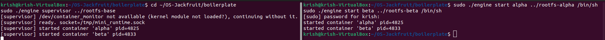
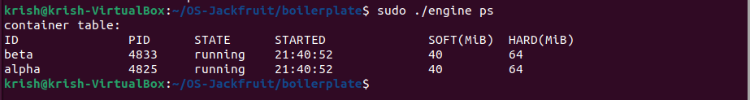
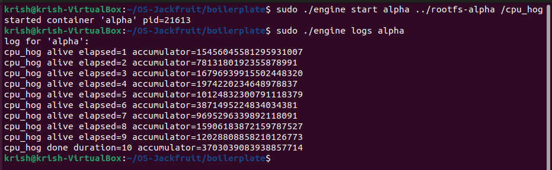
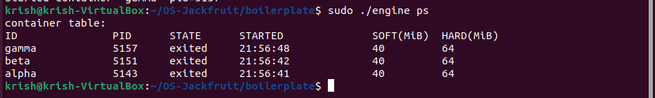
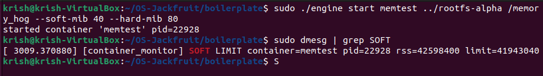
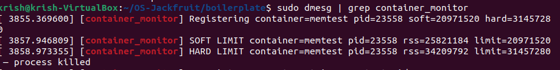
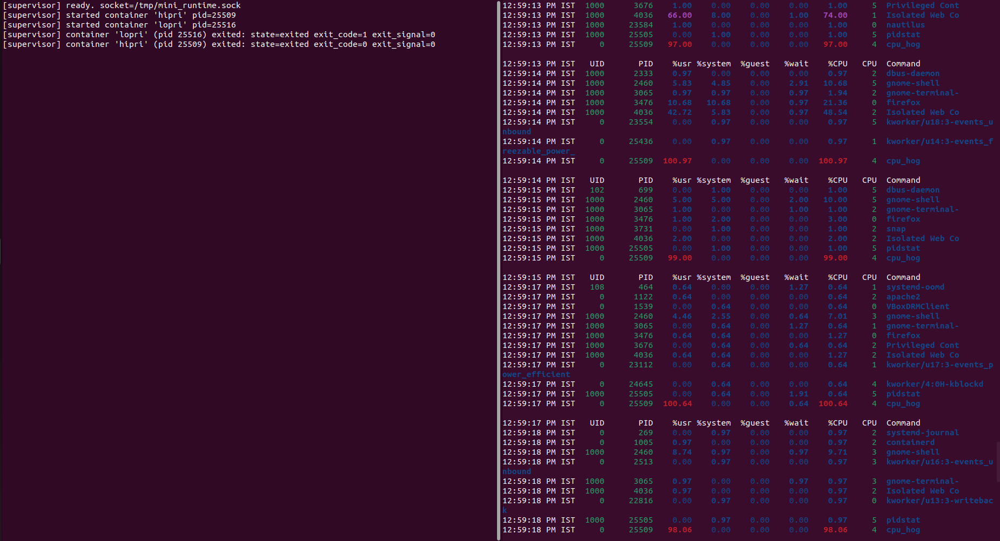
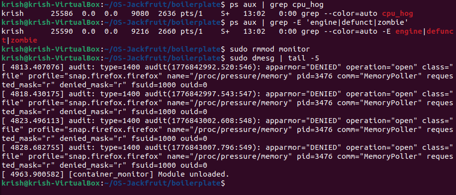

# Multi-Container Runtime

## Team Information

* Name : KRISH YADAV
* SRN : PES1UG24CS234

---

## Project Summary

This project implements a lightweight container runtime in C with:

* Supervisor process
* Kernel memory monitor
* Multiple containers
* Memory limits (soft + hard)
* CPU scheduling experiments

---

# Setup & Installation

## Install Dependencies

```bash
sudo apt update
sudo apt install -y build-essential linux-headers-$(uname -r)
```

---

## Setup Root Filesystem

```bash
mkdir rootfs-base
wget https://dl-cdn.alpinelinux.org/alpine/v3.20/releases/x86_64/alpine-minirootfs-3.20.3-x86_64.tar.gz
tar -xzf alpine-minirootfs-3.20.3-x86_64.tar.gz -C rootfs-base

cp -a rootfs-base rootfs-alpha
cp -a rootfs-base rootfs-beta
```

---

# Build

```bash
cd boilerplate
make clean
make
```

---

# Load Kernel Module

```bash
sudo insmod monitor.ko
lsmod | grep monitor
```

---

# Start Supervisor (Terminal 1)

```bash
sudo ./engine supervisor ../rootfs-base
```

**Screenshot 1 – Supervisor Running**



---

# Container Operations (Terminal 2)

---

## Start Containers

```bash
sudo ./engine start alpha ../rootfs-alpha /bin/sh
sudo ./engine start beta ../rootfs-beta /bin/sh
```

**Screenshot 2 – Multi Container Start**



---

## View Containers

```bash
sudo ./engine ps
```

**Screenshot 3 – Container Table**



---

## Logs

```bash
sudo ./engine logs alpha
```

**Screenshot 4 – Logging Output**



---

## CLI + IPC

```bash
sudo ./engine start beta ../rootfs-beta /bin/sh
sudo ./engine ps
sudo ./engine stop beta
sudo ./engine ps
```

**Screenshot 5 – CLI Interaction**



---

# Memory Limit Testing

## Run Memory Test

```bash
sudo ./engine start memtest ../rootfs-alpha /memory_hog --soft-mib 48 --hard-mib 80
```

---

## Soft Limit

```bash
sudo dmesg | grep "SOFT LIMIT"
```

**Screenshot 6 – Soft Limit**



---

## Hard Limit

```bash
sudo dmesg | tail -20
```

**Screenshot 7 – Hard Limit**



---

# Scheduling Experiment

```bash
sudo ./engine start hipri ../rootfs-alpha /cpu_hog --nice -5
sudo ./engine start lopri ../rootfs-beta /cpu_hog --nice 15
pidstat -u 1 12
```

**Screenshot 8 – Scheduling**



---

# Cleanup

```bash
ps aux | grep -E 'engine|defunct|zombie'
sudo rmmod monitor
sudo dmesg | tail -5
```

---

# Engineering Analysis

---

## Isolation Mechanisms

Isolation in this runtime is achieved through a combination of Linux namespaces and filesystem separation.

### PID Namespace (CLONE_NEWPID)

Each container has its own process tree.  
Processes inside the container start from PID 1 and cannot see host processes.

### UTS Namespace (CLONE_NEWUTS)

Allows each container to have its own hostname.

### Mount Namespace (CLONE_NEWNS)

Mount operations inside containers do not affect the host.

### Filesystem Isolation

Each container runs inside its own root filesystem copy.

Containers share the host kernel, which is why kernel-level monitoring is required.

---

## Supervisor and Process Lifecycle

The supervisor manages all containers.

Responsibilities include:

* Creating containers using clone()
* Tracking container metadata
* Reaping processes using waitpid()
* Managing lifecycle events

The supervisor prevents zombie processes and maintains system stability.

---

## IPC and Logging

Multiple IPC mechanisms are used:

### CLI → Supervisor

Unix domain sockets allow command communication.

### Container → Supervisor

Pipes capture stdout and stderr.

### Kernel Communication

IOCTL calls to `/dev/container_monitor` allow the kernel module to track memory limits.

---

## Logging System

Logging follows a producer-consumer model.

Producer threads read container output from pipes.

Consumer threads write logs to disk.

Synchronization uses mutexes and condition variables.

This bounded buffer prevents unlimited memory growth.

---

## Memory Enforcement

Memory tracking uses RSS (Resident Set Size).

Two limits exist:

### Soft Limit

Logs a warning but does not kill the process.

### Hard Limit

The kernel module sends SIGKILL to terminate the process.

Kernel-space enforcement ensures reliability under heavy load.

---

## Scheduling Behavior

The runtime uses Linux Completely Fair Scheduler (CFS).

Priority is controlled via nice values.

Lower nice value → higher priority  
Higher nice value → lower priority

The scheduling experiment demonstrates how CPU time is distributed.

---

# Scheduling Experiment Results

| Container | Nice Value | Behavior |
|-----------|------------|----------|
| hipri | -5 | Higher CPU share |
| lopri | 15 | Lower CPU share |

CFS maintains fairness while prioritizing high priority tasks.

---

# Final Ubuntu Verification Checklist

```bash
cd boilerplate
make clean
make

sudo insmod monitor.ko
ls -l /dev/container_monitor

sudo ./engine supervisor ../rootfs-base

cp -a ../rootfs-base ../rootfs-alpha
cp -a ../rootfs-base ../rootfs-beta

sudo ./engine start alpha ../rootfs-alpha /bin/sh --soft-mib 48 --hard-mib 80 --nice -5
sudo ./engine start beta ../rootfs-beta /bin/sh --soft-mib 64 --hard-mib 96 --nice 10

sudo ./engine ps
sudo ./engine logs alpha

sudo ./engine stop alpha
sudo ./engine stop beta

ps aux | grep -E 'defunct|engine'
dmesg | tail -50

sudo rmmod monitor
```

---

# Pass Criteria

* Project builds successfully
* Kernel module loads correctly
* Containers visible in `engine ps`
* Memory limits appear in `dmesg`
* No zombie processes remain
* Kernel module unloads successfully
